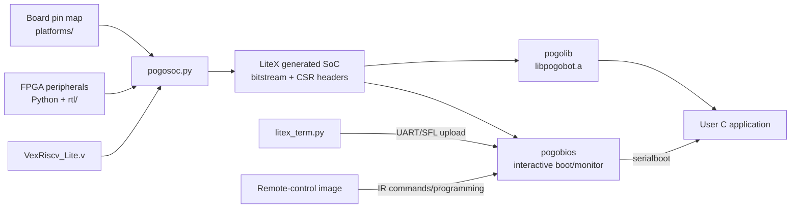

# Software current state

Last inspected: 2026-09-14

## Scope and baseline

This document describes `Software/` in the local checkout of
[`nekonaute/pogobot`](https://github.com/nekonaute/pogobot). The inspected
revision is `bffede6b47e4dc4ead189d8d49ede48decd1d3cd` on branch
`optimized_remote_transfer`. The branch points at the same commit as the local
`origin/sdk_2_7_new` tracking branch and is 12 commits ahead of the local
`main`; no remote fetch was performed during this inspection.

The current release macro is `v2.7`. Relative to local `main`, this branch adds
the LIS2MDL magnetometer, IR mute/unmute and remote-control operations, a
64 KiB user-writable flash API, IR interrupt-flag clearing, three test
applications, and API 2.7 binary images.

This was a source-level investigation. Python, JavaScript, and shell syntax was
checked, but no full FPGA synthesis, RISC-V firmware build, flash operation, or
hardware test was performed.

## System model

Pogobot is not a fixed-microcontroller firmware project. The application CPU
and most peripherals are synthesized into a Lattice iCE40UP5K FPGA by LiteX and
Migen. C firmware then runs on a VexRiscv RV32 soft core.



At the default configuration, the generated SoC uses:

- a VexRiscv `rv32im/ilp32` CPU at 21 MHz;
- 128 KiB of iCE40UP5K SPRAM as system SRAM;
- memory-mapped SPI flash plus bit-banged access for writes and shared SPI
  peripherals;
- one shared IR transmitter and four directional TS4231 receivers on a robot;
- 512-word TX and per-receiver RX FIFOs;
- three 10-bit motor PWM channels and direction GPIOs;
- five daisy-chained RGB LEDs;
- IMU, ADC/photosensor/battery, and—on equipped v3 heads—LIS2MDL
  magnetometer access.

The `--remocon` build changes the hardware personality: it keeps one IR
receiver/transmitter, adds three high-power IR LED outputs, disables motor PWM,
and defines `REMOCON` for the C firmware.

## Directory map

| Path | Role | Notes |
| --- | --- | --- |
| [`pogosoc.py`](../Software/pogosoc.py) | Primary SoC/build/image entry point | Selects a board target, instantiates LiteX peripherals, invokes the builder, compiles Pogobios, and emits programming manifests/images. |
| [`platforms/`](../Software/platforms/) | Board pin/resource definitions | Includes the development board and Pogobot, v2, v2.1, and v3 mappings. v2.1 and v3 are currently identical files. |
| [`targets/`](../Software/targets/) | Clock and legacy/standalone target support | `targets/pogobot.py` supplies the clock/reset generator used by `pogosoc.py`; the other files appear to be older or development-board entry points. |
| [`rtl/`](../Software/rtl/) | Small FPGA support blocks | Warmboot, firmware ROM helpers, iCE40 RGB driver, and the checked-in VexRiscv Verilog core. |
| Top-level Python peripherals | Custom gateware and host tools | `ts4231.py`, `spi_flash.py`, `neopixel.py`, and `pwm.py` implement SoC peripherals; `litex_term.py` and `sb_bridge_client.py` are host-side tools. |
| [`pogobios/`](../Software/pogobios/) | Resident monitor/boot firmware | UART command shell, serial and IR programming, flash-status handling, diagnostics, and robot/remote commands. |
| [`pogolib/`](../Software/pogolib/) | Robot C library | Public API plus IR/SLIP, sensor, motor, RGB, timer, SPI flash, and startup implementations. Produces `libpogobot.a`. |
| [`sdk/`](../Software/sdk/) | SDK packager | Copies generated LiteX headers/build rules, libraries, linker script, upload tool, and examples into `sdk/build_sdk`. |
| [`example/`](../Software/example/) | User firmware | 31 example/test directories, all following the same generated-header + standalone-SDK link flow. |
| [`binary_installation/`](../Software/binary_installation/) | Prebuilt releases | Robot and remote images for API v2 through v2.7 plus direct-programming scripts. |
| [`pogobject/`](../Software/pogobject/) | ESP8266 bridge appliance | Arduino firmware exposes REST operations over Wi-Fi and forwards BIOS commands over a 115200-baud software UART; a static browser UI is included. |
| [`pogoWallApp/`](../Software/pogoWallApp/) | Multi-remote desktop UI | Experimental Electron application for up to four `/dev/ttyUSB*` remotes. |
| `build/` | Derived output | A local, ignored 470 MiB bootloader build was present when inspected; it is not source of truth. |

## Gateware and build flow

The normal expert-mode entry point is:

```sh
cd Software
./pogosoc.py --target=pogobotv3 --cpu-variant=lite --build
```

`pogosoc.py` imports `platforms.<target>`, creates `BaseSoC`, and uses LiteX's
`Builder`. It forces the checked-in `rtl/VexRiscv_Lite.v` for the `lite` CPU
variant and overrides the Yosys/nextpnr templates with iCE40 density options.
The build also generates the headers and Make variables that bind C code to a
specific gateware CSR and memory map. Consequently, the SDK is gateware-version
dependent.

The main supported target names exposed by the CLI are:

| Target | Status visible in source |
| --- | --- |
| `pogobotv3` | Default in the top-level and `pogolib` Makefiles; 2 MiB flash; current SDK/release target. |
| `pogobotv2_1` | Same pin map and current SoC feature branch as v3, but selected as a 1 MiB v2-family flash target. |
| `pogobotv2` | Older direct motor-pin layout and 1 MiB flash. |
| `pogobot` | Earlier board with USB/K210-related resources. |
| `lattice_ice40up5k_evn` | Development/evaluation board; requires an explicit flash size in the main entry point. |

The repository pins LiteX-family repositories in `litex_version.txt` and the
README calls for Yosys 0.18, a specific nextpnr commit, Icestorm, and a SiFive
RISC-V GCC 10.1.0 toolchain. On the inspected machine Yosys, nextpnr, icepack,
iceprog, and pyserial were available, but the RISC-V compiler and Python
`migen`, `litex`, and `litescope` modules were absent. This prevented a
meaningful clean build.

### Produced images and upload path

A normal image reserves the first flash region for a bootloader image and puts
the user/current gateware and Pogobios at later offsets. A bootloader build also
generates the 160-byte iCE40 multiboot header. `pogosoc.py` emits JSON manifests
for `litex_term.py`, which speaks LiteX's serial-flash-loader protocol over the
robot UART.

The intended high-level workflow is:

1. Build gateware and Pogobios once for the correct board personality.
2. Package the matching SDK with `make -C Software/sdk`.
3. Build a user application, usually starting from `example/helloworld`.
4. Connect with `make connect TTY=/dev/ttyUSBN`; the terminal uploads the
   application after the robot's `serialboot` command.
5. Use `run` to warmboot into the last valid user image.

The bootloader and current/user image separation is implemented with the
iCE40 `SB_WARMBOOT` primitive. Firmware uses a marker at flash offset `0x88000`
to distinguish complete, partial, and absent user images.

## Flash and RAM layout

For the current v3 configuration, generated files in the local ignored build
confirm:

- SRAM at CPU address `0x00000000`, size `0x20000` (128 KiB);
- SPI flash mapped at CPU address `0x00200000`, size `0x200000` (2 MiB);
- bootloader Pogobios ROM at CPU address `0x00220000`, size `0x10000`;
- normal/user Pogobios ROM at CPU address `0x00260000`.

The documented physical flash offsets are:

| Flash offset | Reserved region | Content |
| --- | --- | --- |
| `0x000000` | `0x0000a0` | iCE40 multiboot header |
| `0x0000a0` | through `0x01ffff` | Bootloader gateware |
| `0x020000` | `0x020000` bytes | Bootloader Pogobios |
| `0x040000` | `0x020000` bytes | User/current gateware |
| `0x060000` | `0x020000` bytes | User/current Pogobios or application |
| `0x088000` | marker sector | `FlashIsOK` / `FlashIsPar` state |
| `0x090000` (apparent intended offset) | `0x010000` bytes | SDK 2.7 user-writable pages; see review item below |

The linker places executable/read-only application content in flash-backed
`rom`, copies initialized data to SRAM, puts BSS in SRAM, and starts the stack
at the top of the 128 KiB SRAM. This makes RAM/stack pressure important even
when flash capacity is ample. In particular, each long IR message is about
390 bytes and `pogolib_infrared.c` statically allocates per-receiver SLIP
buffers plus a 20-message queue.

## Firmware layers

### Pogobios

[`pogobios/main.c`](../Software/pogobios/main.c) initializes `pogolib`, prints
SoC/release/identity information, and runs a polling shell. On robots the loop
also updates IR reception, dispatches BIOS commands received with the IR magic
prefix, controls status LEDs, and supports standby/autotest/battery-display
modes. On a remote-control build it instead configures maximum IR power and
exposes commands that relay commands, application data, reboot/mute operations,
or firmware frames to robots.

Commands are registered into linker sections with `define_command`. The source
currently registers roughly 65 names spanning:

- system inspection and boot: `help`, `ident`, `uptime`, `crc`, `run`,
  `reboot_to`, and flash/serial-boot support;
- robot hardware: motor power/direction, RGB LEDs, IMU, ADC/battery,
  magnetometer autotest, serial number, and SPI security registers;
- IR configuration and diagnostics: initialization, power, timing, send/read,
  monitor, echo cancellation, and loop tests;
- remote control: command/user-message relay, mute/unmute, reboot, erase, and
  robot flashing.

### Pogolib and public application API

[`pogolib/pogobot.h`](../Software/pogolib/pogobot.h) is the public umbrella
header. `pogobot_init()` is mandatory and sets up timing, interrupts/UART,
shared SPI, remembered motor directions, IMU/magnetometer, RGB LEDs, and IR
SLIP state.

The main API groups are:

- directional or omnidirectional long/short IR messages, receive queue, power,
  error counters, and mute state;
- RGB color control for the chain or an individual LED;
- three photosensors, battery voltage, IMU acceleration/gyro/temperature, and
  magnetometer samples;
- power and direction for right, left, and rear/middle motors, including flash
  persistence;
- microsecond timers, stopwatches, and sleep helpers;
- robot identity/random-seed helpers;
- SDK 2.7 page erase/read/write operations for a dedicated flash section.

IR application frames use SLIP framing plus CRC-32. A long message has an
8-byte header (type, emitter powers, sender ID/directions, and payload length)
and a payload capped at 382 bytes. A short message uses a 3-byte logical header
and omits sender metadata. Received long user messages are copied into a static
20-entry FIFO.

## Auxiliary software

### Pogobject

The Pogobject combines a Pogobot v3 head with a DFRobot FireBeetle ESP8266,
OLED, battery measurement, and an external PWM LED. Its Arduino sketch stores
Wi-Fi credentials in ESP8266 EEPROM, offers an access-point configuration mode,
and exposes REST endpoints for status, UART command forwarding, LED intensity,
Pogobot reset, and battery refresh. The included static web page calls this API
over the local network.

### Pogo Wall App

The wall application scans `/dev` once at startup for names containing
`ttyUSB`, opens every match at 115200 baud, and gives the renderer one UI panel
per device. It is Linux-specific in its present form and exits if no matching
device is found. The preload bridge constrains renderer-to-main-process IPC,
which is preferable to enabling direct Node access in the renderer.

## Current review items

These are observations, not fixes. Hardware-affecting items should be resolved
against the schematics, known-good binaries, and an expendable/test robot
before changing or flashing anything.

1. **Physical versus mapped flash addresses are inconsistent.** The documented
   v3 flash is 2 MiB with CPU mapping base `0x200000`, and `pogosoc.py` writes
   serial-upload manifests at physical offsets plus that mapping base. Direct
   `iceprog` scripts instead pass `0x240000` and `0x260000`, while the SDK 2.7
   page API passes `0x290000` directly to 24-bit SPI commands. Those values look
   like CPU-mapped addresses, whereas the rest of the low-level SPI routines
   use physical offsets such as `0x88000`. Verify whether the intended physical
   values are `0x40000`, `0x60000`, and `0x90000` before using these paths.

2. **The magnetometer read contract is reversed in documentation.** Both
   `pogobot.h` and the implementation comment say `magn_read_XYZ()` returns 1
   on success, but the implementation and test example use 0 for success and 1
   for timeout. Existing behavior should be treated as the implementation
   contract until deliberately reconciled.

3. **SDK 2.7 remote command names differ from the release note.** The release
   note names `rc_mute` and `rc_unmute`; the registered BIOS commands are
   `rc_mute_ir` and `rc_unmute_ir`.

4. **The Electron application is not self-contained in Git.** Its README says
   to run `npm start`, and source files require Electron and `serialport`, but
   `package.json` and its lock file are absent because the repository-wide
   `*.json` ignore rule also ignores Node manifests. The checked-in JavaScript
   parses, but the documented install/launch command cannot be reproduced from
   this tree alone.

5. **The SDK packaging Makefile mutates the LiteX source checkout.** Its `sdk`
   recipe removes all CPU-core directories other than `vexriscv` below
   `$(SOC_DIRECTORY)/cores/cpu`. That is outside the SDK output directory and
   can damage a shared dependency checkout. Run SDK packaging only in a
   disposable/pinned dependency tree until this is corrected.

6. **Documentation and defaults span several generations.** The primary
   README still describes Ubuntu 20.04 and old pinned tooling; Pogobios defaults
   to `pogobotv2`, while the top-level build, library, examples, SDK packaging,
   and current binaries center on `pogobotv3`. Always pass `TARGET=pogobotv3`
   explicitly for current builds.

7. **Automated coverage is very small.** Two Migen simulations exercise the
   NeoPixel and TS4231 PHY blocks, but there is no repository CI configuration
   or host-side C test harness visible under `Software/`. Most C examples named
   `test_*` are firmware intended to run on hardware.

## Suggested reading order

For a new contributor, the shortest useful path is:

1. [`Software/readme.md`](../Software/readme.md) for the intended operator
   workflow and flash layout.
2. [`Software/pogosoc.py`](../Software/pogosoc.py), then
   [`Software/platforms/pogobotv3.py`](../Software/platforms/pogobotv3.py), for
   the actual SoC and board wiring.
3. [`Software/pogolib/pogobot.h`](../Software/pogolib/pogobot.h) and
   [`Software/example/helloworld/main.c`](../Software/example/helloworld/main.c)
   for application development.
4. [`Software/pogobios/main.c`](../Software/pogobios/main.c),
   [`Software/pogobios/boot.c`](../Software/pogobios/boot.c), and the command
   files for boot, programming, and maintenance behavior.
5. [`Software/ts4231.py`](../Software/ts4231.py) and
   [`Software/pogolib/pogolib_infrared.c`](../Software/pogolib/pogolib_infrared.c)
   for the most project-specific data path: directional IR communication.
